# RL-for-Transportation
Paper list of Reinforcement Learning (RL) applied on transportation

- [RL-for-Transportation](#rl-for-transportation)
  - [Ride-sourcing system](#ride-sourcing-system)
    - [Survey](#survey)
    - [Dataset](#dataset)
    - [Competition](#competition)
    - [Book](#book)
    - [Paper](#paper)
      - [Order dispatching](#order-dispatching)
        - [1. A Taxi Order Dispatch Model based On Combinatorial Optimization. 2017. KDD](#1-a-taxi-order-dispatch-model-based-on-combinatorial-optimization-2017-kdd)
        - [2. Large-scale order dispatch in on-demand ride-hailing platforms: A learning and planning approach. 2018. KDD](#2-large-scale-order-dispatch-in-on-demand-ride-hailing-platforms-a-learning-and-planning-approach-2018-kdd)
        - [3. A Deep Value-network Based Approach for Multi-Driver Order Dispatching. 2019. KDD](#3-a-deep-value-network-based-approach-for-multi-driver-order-dispatching-2019-kdd)
        - [4. Efficient Ridesharing Order Dispatching with Mean Field Multi-Agent Reinforcement Learning. 2019. WWW](#4-efficient-ridesharing-order-dispatching-with-mean-field-multi-agent-reinforcement-learning-2019-www)
        - [5. Multi-Agent Reinforcement Learning for Order-dispatching via Order-Vehicle Distribution Matching. 2019. CIKM](#5-multi-agent-reinforcement-learning-for-order-dispatching-via-order-vehicle-distribution-matching-2019-cikm)
      - [Order delaying](#order-delaying)
        - [1. Learning to delay in ride-sourcing systems: a multi-agent deep reinforcement learning framework. 2019. TKDE](#1-learning-to-delay-in-ride-sourcing-systems-a-multi-agent-deep-reinforcement-learning-framework-2019-tkde)
        - [2. Optimizing matching time intervals for ride-hailing services using reinforcement learning. 2021. TRC](#2-optimizing-matching-time-intervals-for-ride-hailing-services-using-reinforcement-learning-2021-trc)
      - [Order pooling](#order-pooling)
        - [1. Optimizing Taxi Carpool Policies via Reinforcement Learning and Spatio-Temporal Mining. 2018. Big Data](#1-optimizing-taxi-carpool-policies-via-reinforcement-learning-and-spatio-temporal-mining-2018-big-data)
        - [2. DeepPool: Distributed Model-free Algorithm for Ride-sharing using Deep Reinforcement Learning. 2019. ITS](#2-deeppool-distributed-model-free-algorithm-for-ride-sharing-using-deep-reinforcement-learning-2019-its)
        - [3. AdaPool: A Diurnal-Adaptive Fleet Management Framework using Model-Free Deep Reinforcement Learning and Change Point Detection. 2021.](#3-adapool-a-diurnal-adaptive-fleet-management-framework-using-model-free-deep-reinforcement-learning-and-change-point-detection-2021)
        - [4. An Integrated Decomposition and Approximate Dynamic Programming Approach for On-Demand Ride Pooling. 2018. ITS](#4-an-integrated-decomposition-and-approximate-dynamic-programming-approach-for-on-demand-ride-pooling-2018-its)
        - [5. Neural Approximate Dynamic Programming for On-Demand Ride-Pooling. 2020. AAAI](#5-neural-approximate-dynamic-programming-for-on-demand-ride-pooling-2020-aaai)
        - [6. Conditional Expectation Based Value Decomposition For Scalable On-demand Ride Pooling](#6-conditional-expectation-based-value-decomposition-for-scalable-on-demand-ride-pooling)
      - [Order pricing](#order-pricing)
        - [1. InBEDE: Integrating Contextual Bandit with TD Learning for Joint Pricing and Dispatch of Ride-Hailing Platforms. 2019. ICDM](#1-inbede-integrating-contextual-bandit-with-td-learning-for-joint-pricing-and-dispatch-of-ride-hailing-platforms-2019-icdm)
      - [Vehicle relocation](#vehicle-relocation)
      - [Joint dispatching and relocation](#joint-dispatching-and-relocation)
  - [Intersection control](#intersection-control)
    - [Survey](#survey-1)
    - [Dataset](#dataset-1)
    - [Competition](#competition-1)
    - [Paper](#paper-1)
      - [Single-agent](#single-agent)
      - [Multi-agent](#multi-agent)

## Ride-sourcing system
### Survey
1. [Reinforcement Learning for Ridesharing: A Survey. 2021](https://arxiv.org/pdf/2105.01099)
### Dataset
1. [DiDi GAIA Dataset](https://outreach.didichuxing.com/research/opendata/)
### Competition
1. [Learning to Dispatch and Reposition on a Mobility-on-Demand Platform](https://www.biendata.xyz/competition/kdd_didi/)
### Book
1. Approximate Dynamic Programming: Solving the curses of dimensionality. Powell, W. B. (2007).
   
### Paper
#### Order dispatching
##### 1. [A Taxi Order Dispatch Model based On Combinatorial Optimization. 2017. KDD](https://dl.acm.org/doi/pdf/10.1145/3097983.3098138)
 1. predict cancellation probability of vehicle-order pair $p_{ij}$
 2. maximize total success rate: 
     
     1. $a_{ij}$: matching decision
     2. NP hard combinatorial optimization
        1. HillClimbing Algorithm
##### 2. [Large-scale order dispatch in on-demand ride-hailing platforms: A learning and planning approach. 2018. KDD](https://dl.acm.org/doi/pdf/10.1145/3219819.3219824)

1. bipartite matching + evaluation

    1. weight: advantage trick
       1. discounted reward + furture value - current value 
       
    2. state: time & space zone (no contextual information)
    3. value: policy evaluation (offline)
          

##### 3. [A Deep Value-network Based Approach for Multi-Driver Order Dispatching. 2019. KDD](https://dl.acm.org/doi/pdf/10.1145/3292500.3330724)
1. bipartite matching + policy evaluation

   1. weight: advantage value - distance
     
   2. state: 
      1. time & space zone + supply-demand info
      2. coarse coding with hierarchical hexagon grid
   3. value (offline)
      1. policy evaluation: with supply-demand info
      2. distillation: marginalize time-space value

##### 4. [Efficient Ridesharing Order Dispatching with Mean Field Multi-Agent Reinforcement Learning. 2019. WWW](https://dl.acm.org/doi/pdf/10.1145/3308558.3313433)
 1. MARL (on policy)
      1. state: contextual information
      2. acrion: active order pool
         1. mean action: defined as number of neighbor drivers
      3. reward:
         1. order fare
         2. pick distance
         3. destination supply-demand gap
   
##### 5. [Multi-Agent Reinforcement Learning for Order-dispatching via Order-Vehicle Distribution Matching. 2019. CIKM](https://dl.acm.org/doi/pdf/10.1145/3357384.3357799)
 1. MARL (on policy)
    1. state: contextual features
    2. TD loss + KL regulizer

       1. regulizer: distribution between order and vehicles

#### Order delaying
##### 1. [Learning to delay in ride-sourcing systems: a multi-agent deep reinforcement learning framework. 2019. TKDE](https://ieeexplore.ieee.org/stamp/stamp.jsp?tp=&arnumber=9130935)
 1. MARL (on policy)
    1. state: contextual features
    2. action: {0,1}, match or hold
    3. reward: customer waiting time
       1. weighted global + individual reward

##### 2. [Optimizing matching time intervals for ride-hailing services using reinforcement learning. 2021. TRC](https://www.sciencedirect.com/science/article/abs/pii/S0968090X21002527)
1. RL (off policy)
   1. state: global grid-based state -> flatten
   2. action: {0,1}, match or hold
   3. reward:
      1. matching wating time
      2. pickup wiating time

#### Order pooling
##### 1. [Optimizing Taxi Carpool Policies via Reinforcement Learning and Spatio-Temporal Mining. 2018. Big Data](https://ieeexplore.ieee.org/document/8622481)
1. RL (on policy)
   1. state: time & space grid
   2. action: wait, TK1, TK2
      1. wait: stay current location
      2. TK1: pick orders within max pick time
      3. TK2: TK1 + larger pick time for second order
   3. reward: effective distance traveled

##### 2. [DeepPool: Distributed Model-free Algorithm for Ride-sharing using Deep Reinforcement Learning. 2019. ITS](https://ieeexplore.ieee.org/abstract/document/8793143)
 1. RL (on policy)
    1. state: global supply-demand profile map
    2. action (sequentially): follow shorest path
       1. find another customer 
       2. next zone 
    3. reward
       1. served customer
       2. detour time

##### 3. [AdaPool: A Diurnal-Adaptive Fleet Management Framework using Model-Free Deep Reinforcement Learning and Change Point Detection. 2021.](https://arxiv.org/pdf/2104.00203.pdf)
 1. The same as DeepPool
    1. consider the change of MDP （with different models）
    2. online Dirichlet change point detection (ODCP) to detect changes

##### 4. [An Integrated Decomposition and Approximate Dynamic Programming Approach for On-Demand Ride Pooling. 2018. ITS](https://ieeexplore.ieee.org/document/8805157)
 1. ADP 
    1. decision 
       1. routes is determined using the shortest-path strategy
       2. one decision one assignment
       3. linear approximation for value function
       4. linear assignment problem
          1. dual update

##### 5. [Neural Approximate Dynamic Programming for On-Demand Ride-Pooling. 2020. AAAI](https://ojs.aaai.org//index.php/AAAI/article/view/5388)
1. ADP
   1. decision
      1. follow shorest path
      2. generate feasible order combinations
      3. value approximation: individual value 
         
         1. low-dimensional embedding for each location of vehicle
      4. linear assignment 
         1. TD update
   
##### 6. [Conditional Expectation Based Value Decomposition For Scalable On-demand Ride Pooling]()
1. like NeuralADP
   1.  average of neighbor value to approximate indivadule value:
   2.  each neighbor value is the conditional expectation of action
      
   3. final approximation
      

#### Order pricing
##### 1. [InBEDE: Integrating Contextual Bandit with TD Learning for Joint Pricing and Dispatch of Ride-Hailing Platforms. 2019. ICDM](https://ieeexplore.ieee.org/document/8970929)
    1. RL (on-policy)
       1. use TD learning to calculate furture value
       2. use Contextual Bandit to give price

#### Vehicle relocation
1. [A Cost-Effective Recommender System for Taxi Drivers. 2014. KDD](https://dl.acm.org/doi/pdf/10.1145/2623330.2623668)
    1. recommend route for vacant vehicles
       1. segment profit
          1. earning:
   
          2. cost: 
   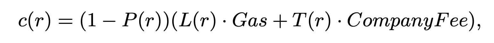
       2. expected route profits:
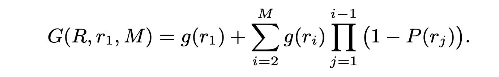
       3. algorithm 
          1. Brute-Force based MNP Recommendation
          2. Recursive Recommendation Strategy
       4. multi-driver routes recommendation
          1. recommend the route with the lowest correlationship to the second driver

2. [Optimizing Taxi Driver Profit Efficiency: A Spatial Network-based Markov Decision Process Approach. 2015. Big Data]()
   1. Defined as MDP:
      1. calibrate pick probability (discounted by number of taxis)
      2. passenger destination probability
   2. solving
      1. Rolling Horizon:
      2. DP approach
         1. discounting pick prob:
         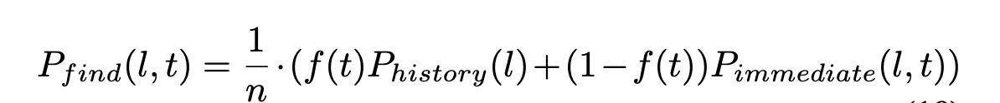

3. [Optimal Passenger-Seeking Policies on E-hailing Platforms Using Markov Decision Process and Imitation Learning. 2020. TRC](https://arxiv.org/pdf/1905.09906.pdf)
   1. similar to last one
      1. long-horizon 
      2. discounted prob of competing drivers
    

4. [MOVI: A Model-Free Approach to Dynamic Fleet Management. 2018. INFOCOM](https://ieeexplore.ieee.org/stamp/stamp.jsp?arnumber=8485988)
    1. RL (on-policy)
       1. state: heatmap + CNN
       2. making decision sequentially for each vehicle

5. [Credit Assignment For Collective Multiagent RL With Global Rewards. 2018. NIPS](https://proceedings.neurips.cc/paper/2018/file/94bb077f18daa6620efa5cf6e6f178d2-Paper.pdf)
    1. MARL (on policy)
       1. centralize critic + decentralized policy
       2. conut based global state
     
       3. difference policy gradient
            1. Wonderful Life Utility (WLU)
               1. with and without agent i
   
            1. Aristrocratic Utility (AU)
               1. fix actions of other agents, marginalize agent i
               2. conterfactual
   
        4. approximating central xritic
           1. linear combination
              1. individual information
              2. f without info of other agents
   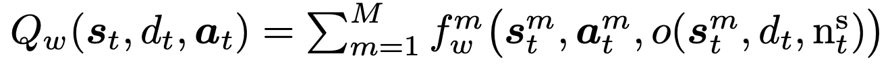
           2. first-order approximation
              1. those coefficients are evaluated at the overall state-action counts
   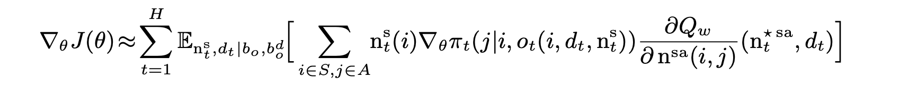

6. [Efficient Large-Scale Fleet Management via Multi-Agent Deep Reinforcement Learning. 2018. KDD](https://dl.acm.org/doi/pdf/10.1145/3219819.3219993)
    1. RL (on-policy)
       1. state + contextual features
       2. action: neighbor girds
          1. sequentially make decision
          2. avoid moving in conflict directions
             1. add collaborative context indicating directions of previous vehicles
          3. avoid moving to low-value grid

7. [Real-world Ride-hailing Vehicle Repositioning using Deep Reinforcement Learning. 2020. NIPS](https://arxiv.org/pdf/2103.04555.pdf)
    1. Policy evaluation (off-line)
       1. time-space value function
          1. dual policy evaluation
             1. conditional value: V(s|b)
             2. marginal value: V(s)
          2. Value-based Policy Search (VPS)
             1. one-step:
             2. two-step: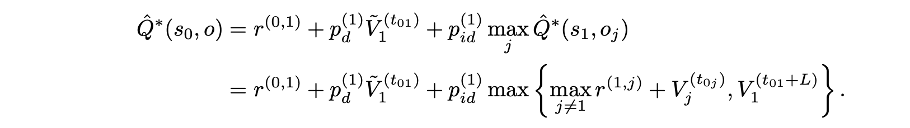
          3. implementation
             1. step selection: small works well
             2. long search: choose global top points
             3. contextual value: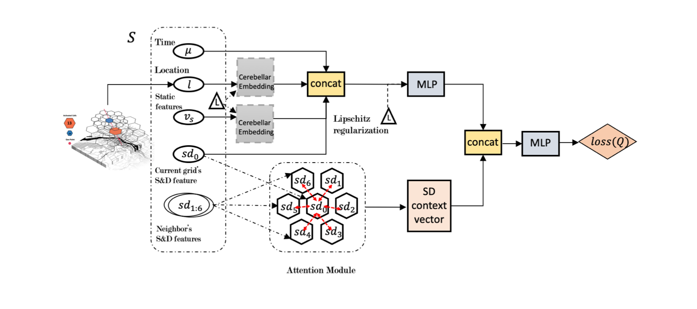
             4. SD regulizer
                1. add destination supply-demand gap

#### Joint dispatching and relocation
1. [CoRide: Joint Order Dispatching and Fleet Management for Multi-Scale Ride-Hailing Platforms. 2019. CIKM](https://dl.acm.org/doi/pdf/10.1145/3357384.3357978)
   1. MARL (on-policy), sequentially decision making
       1. hierarchical strucutre
            1. upper level
               1. generate encoding of env using RNN
            2. lower level
               1. using info from upper level, generate prob of different grids
               2. dispatching and relocating 
        1. reward
            1. gap between manager’s entropy and global average entropy
            2. KL divergence of supplt and demand
        2. coordination
            1. using attention to aggregate info of neighbor grids

2. [Value Function is All You Need: A Unified Learning Framework for Ride Hailing Platforms. 2021. KDD](https://dl.acm.org/doi/pdf/10.1145/3447548.3467096)
    1. policy evaluation (off-line)
    2. on-line updateing
       1. using current transitions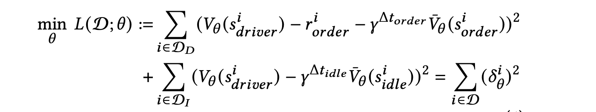
    3. ensemble of offline and online value
    4. dispatching: bipartite matching 
    5. relocaintg: 

1. [An Integrated Reinforcement Learning and Centralized Programming Approach for Online Taxi Dispatching. 2021. TNNLS](https://ieeexplore.ieee.org/stamp/stamp.jsp?arnumber=9366995)
   1. RL (on-policy)
      1. centralized programming model
         1. planning in both dispatching and relocating
      2. TD learning for updating value function

2. [Path-based dynamic pricing for vehicle allocation in ridesharing systems with fully compliant drivers. 2019. TRB](https://www.sciencedirect.com/science/article/pii/S019126151831141X)
    1. ADP (marco level)
       1. decision
         1. path based pricing (market cleaning)
         2. routing after distaching (constrained zone choice)
         3. order sharing
         4. relocation
      1. piece-wise linear approximation of value function

## Intersection control
### Survey 
1. [A survey on traffic signal control methods. 2019](https://arxiv.org/pdf/1904.08117.pdf)
2. [Recent advances in reinforcement learning for traffic signal control: A survey of models and evaluation. 2021](https://dl.acm.org/doi/pdf/10.1145/3447556.3447565)
### Dataset 
1. [Cityflow: A multi-agent reinforcement learning environment for large scale city traffic scenario](https://dl.acm.org/doi/pdf/10.1145/3308558.3314139) 
2. [Reinforcement Learning for Traffic Signal Control
](https://traffic-signal-control.github.io/#open-datasets)
### Competition
1. [City Brain Challenge](http://www.yunqiacademy.org/poster)

### Paper

#### Single-agent
1. [IntelliLight: A Reinforcement Learning Approach for Intelligent Traffic Light Control. 2018. KDD](https://dl.acm.org/doi/pdf/10.1145/3219819.3220096)
    1. state:
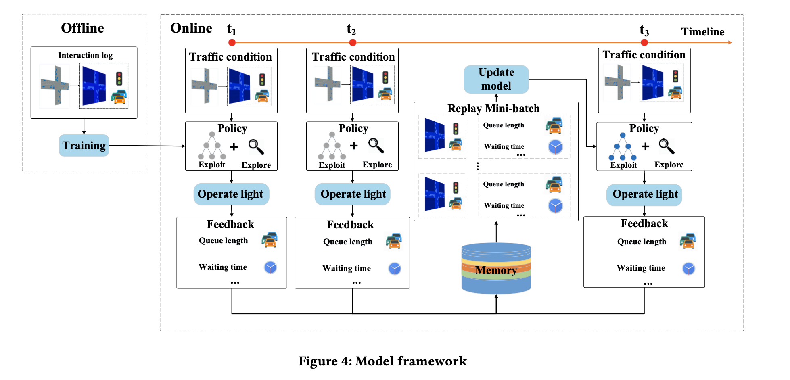
    2. action: {1,0}
       1. change to the next phase
       2. keep phase
    3. reward:
       1. wighted reward of (queue length, delay, waiting time, light switches, number of vehicles, and travel time)
    4. algorithm:
       1. DQN

1. [Learning Traffic Signal Control from Demonstrations. 2019. CIKM](https://dl.acm.org/doi/pdf/10.1145/3357384.3358079)
    1. imitation learning
       1. actor: 
       2. critic: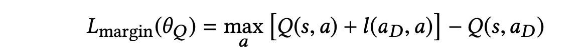

2. [PressLight: Learning Max Pressure Control to Coordinate Traffic Signals in Arterial Network. 2019. KDD](https://dl.acm.org/doi/pdf/10.1145/3292500.3330949)
    1. state:
       1. current pahse (one-hot)
       2. number of vehicles
    2. action:
       1. pre-defined phases
    3. reward:
       1. pressure for movement: 
       2. total pressure: 
    4. algorithm:
       1. DQN

3. [PDLight: A Deep Reinforcement Learning Traffic Light Control Algorithm with Pressure and Dynamic Light Duration. 2020](https://arxiv.org/pdf/2009.13711.pdf)
    1. reward
       1. Pressure with Remaining Capacity of Outgoing Lane: 

4. [Learning Phase Competition for Traffic Signal Control. 2019. CIKM](https://dl.acm.org/doi/pdf/10.1145/3357384.3357900)
    1. state
       1. current phase (one-hot)
       2. number of vehicles
     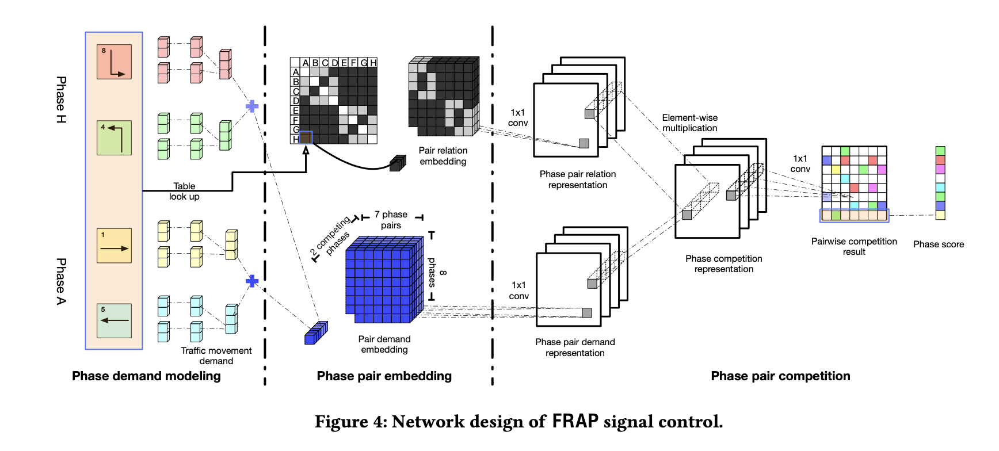
    2. action: 
       1. pre-defined phases
    3. reward: 
       1. queue length
    4. invariance:
       1. flip and rotation

5. [Toward A Thousand Lights: Decentralized Deep Reinforcement Learning for Large-Scale Traffic Signal Control. 2020. AAAI](https://ojs.aaai.org/index.php/AAAI/article/download/5744/5600)
    1. FRAP + pressure reward
    2. reward:
       1. pressure based on queuing vehicles

6. [AttendLight: Universal Attention-Based Reinforcement Learning Model for Traffic Signal Control. 2020. NIPS](https://arxiv.org/pdf/2010.05772.pdf)
    1. state
       1. traffic characteristics in each lane
             
    1. action
       1. pre-defined phases
    2. reward
       1. pressure
    3. algorithm: 
       1. PG + MC
    4. invariance
       1. topology

7. [GeneraLight: Improving Environment Generalization of Traffic Signal Control via Meta Reinforcement Learning. 2020. CIKM](https://dl.acm.org/doi/pdf/10.1145/3340531.3411859)
    1. gradient-based meta learning
       1. training agent in clusetered environments
       2. meta-training

8.  [MetaLight: Value-Based Meta-Reinforcement Learning for Traffic Signal Control. 2020. AAAI](https://ojs.aaai.org/index.php/AAAI/article/view/5467/5323)
    1.  FRAP + gradient-based meta-learning
   
#### Multi-agent
1. [CoLight: Learning Network-level Cooperation for Traffic Signal Control. 2019. CIKM](https://dl.acm.org/doi/pdf/10.1145/3357384.3357902)
   1. information aggregation:
      1. GAT to aggregation neighbor intersection information
    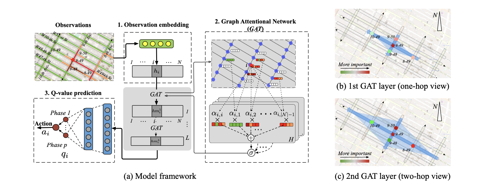

2. [Multi-agent Reinforcement Learning for Networked System Control. 2020. ICLR](https://arxiv.org/pdf/2004.01339.pdf)
    1. differentiable commnication
       1. 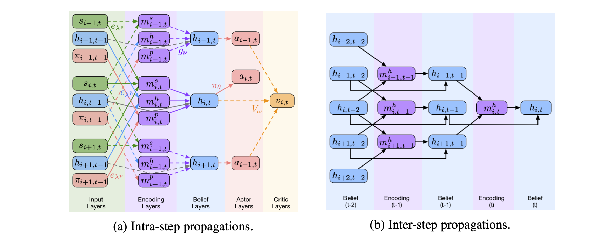

3. [Meta Variationally Intrinsic Motivated Reinforcement Learning for Decentralized Traffic Signal Control. 2021](https://arxiv.org/pdf/2101.00746.pdf)
    1. intrinsic reward
       1. error of predict neighbor reward and transitions
   
    2. latent variable policy
       1. RNN encoded environment

4. [Hierarchically and Cooperatively Learning Traffic Signal Control. 2021. AAAI](https://www.aaai.org/AAAI21Papers/AAAI-6437.XuB.pdf)
    1. Hierarchy
       1. select sub-policies with different reward function
    2. weighted local and neighbor reward
       1. adaptive weighting mechanism
